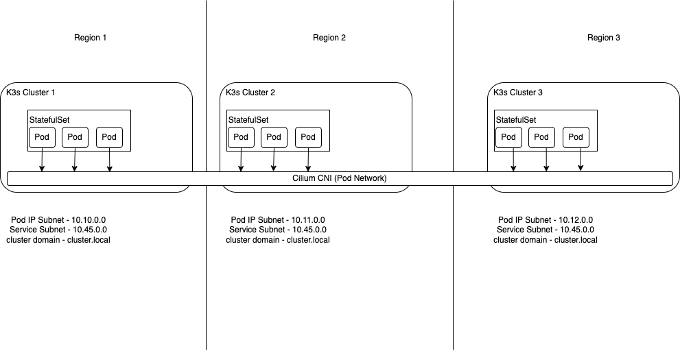

# CockroachDB Azure Multi Region Demo with k3s and CiliumCNI Clustermesh (Manual)

In this demo you will deploy CockroachDB across three Azure Regions. Two regions will be running a K3s Kubernetes Cluster and the third region will be three virtual machines. This is to demonstrate the flexibility that can be achieved in a variety of deployments scenarios.

## Requirements

This solution will deliver the following requirements.

- Deploy a Multi Region CockroachDB solution in Azure.
- Three regions in Kubernetes.
- Cilium will be deployed as the Kubernetes Container Network Interface (CNI)

## Prerequisites 

To complete this demo you will already need the following.

- [Azure CLI](https://docs.microsoft.com/en-us/cli/azure/install-azure-cli)
- [k3sup](https://github.com/alexellis/k3sup)
- [Cilium CLI](https://docs.cilium.io/en/stable/gettingstarted/k8s-install-default/)
- [kubectl](https://kubernetes.io/docs/tasks/tools/install-kubectl-linux/)

## Network Security Rules

|Source|Destination|Port Number|
|------|-----------|-----------|
|Host Workstation|Kubernetes API|6443|
|Host Workstation |SSH Access to Each VM|22|
|*|NodePort Access|30000-32767|

## Architecture

Below is a high-level architecture diagram to show how the three regions are connected. In this solution we will be using the Cilium CNI (Container Network Interface) for Kubernetes to provide the required networking to connect our three k3s Kubernetes clusters. All regions need to have none overlapping address space along with the pod networks in our k3s Kubernetes clusters also not having overlapping address space. This is to ensure that routing is possible without any issues. All of the three regions need to be peered together to allow for communication between the pods in Kubernetes in all three regions.




Cilium's multi-cluster implementation in a nutshell, ClusterMesh provides:
- Pod IP routing across multiple Kubernetes clusters at native performance via tunneling or direct-routing without requiring any gateways or proxies.
- Transparent service discovery with standard Kubernetes services and coredns/kube-dns.
- Network policy enforcement spanning multiple clusters. Policies can be specified as Kubernetes NetworkPolicy resource or the extended CiliumNetworkPolicy CRD.
- Transparent encryption for all communication between nodes in the local cluster as well as across cluster boundaries.

## Deployment Steps

To complete this demo there are a number of steps. These are listed below.

1. [Azure infrastructure setup](azure-infra-setup.md)
1. [Kubernetes setup](kubernetes-setup.md)
1. [Virtual Machine region setup](mv-setup.md)
1. [Network test](network-test.md)
1. [CockroachDB setup](cockroach-setup.md)

## Clean Up

First update the 'teardown.py' script with you kubernetes contexts as we did in the 'setup.py'. Once you have done this run the script. This  is will tidy up your folder and remove any certificates for this deployment we no longer need.

```
python teardown.py
```

Creating resources in Azure costs money, so make sure you delete the Resource Group once you’re finished.
```
az group delete --name $rg
```
## Conclusion

In conclusion there are a number of different way to achieve a Geo-Distributed Cockroach cluster but we believe that by adopting this solution it offers a simple and elegant solution. Kubernetes is already complex to manage without increasing the complexity by introducing technologies such as Multi-Cluster Service Mesh. By adopting a CNI that provides us with the ability to connect Kubernetes in a simple way with very little configuration it reduces the complexity and administrative overhead of managing the solution.

